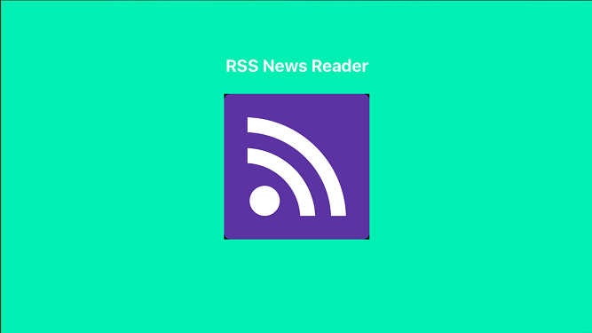

# RSS News Reader
> Read your favorite news from selected RSS feeds!

Make a simple registration using the app. After login you can subscribe to any RSS News Feed. 
In home page you will see the list of RSS News Feed from your subscribed channel.
Click any rss feed to read details news. Enjoy!

## Features

- [x] Login
- [x] Registration
- [x] RSS Subscription Add, Delete Edit
- [x] RSS Feed list with search bar
- [x] Read selected RSS Feed

## Requirements

- Xcode 9.2
- Swift 3.2
- macOS 10.13
- Cocoa Pods 1.4.0

## Installation

1. Clone the project from https://tazim92@bitbucket.org/tazim92/rssnewsreader.git
2. Open 'rssnewsreader.xcworkspace' in Xcode
3. I kept the Pods directory under source control - so after cloning the project you can immediately build and run.
4. Make sure you open the project by from 'rssnewsreader.xcworkspace'
